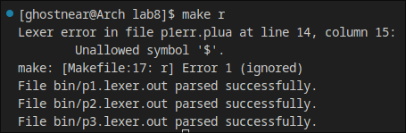

# # Lab 8

Statement: Use lex & yacc

You may use any version (LEX or FLEX) and any version (yacc or bison)

1) Write a LEX specification containing the regular expressions corresponding to a Lua variation with brackets instead of then / end 

2) Use Lex in order to obtain a scanner.

3) Write a specification file containing the production rules corresponding to the language specification.

4) Then, use the parser generator.

BONUS: modify lex to return tokens and use yacc to return string of productions

Fun fact: The language is basically lua with brackets but I made a mistake in the beginning now it's called lua with parantheses.

## Run:

